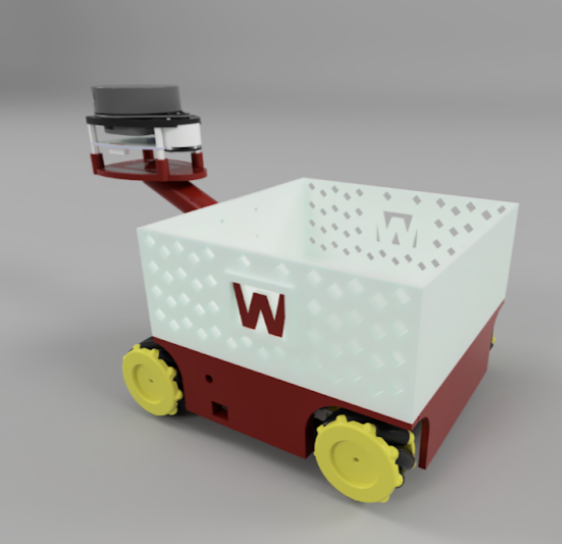
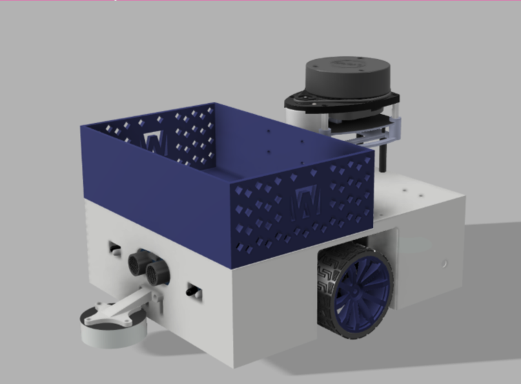
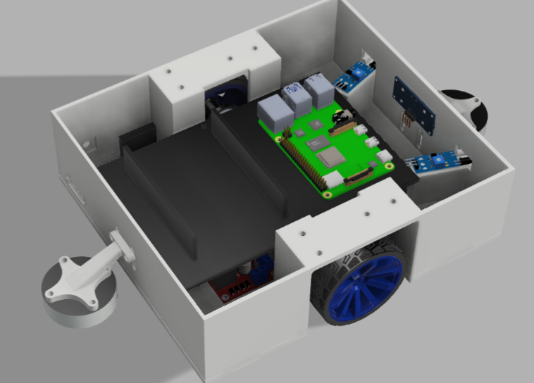
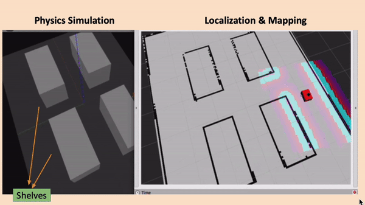

# TART

This is a ROS-driven project on a smart shopping cart that addresses the inefficiency of manual operation of retail trolleys. By employing a LIDAR and various distance sensors, this cart can follow user around in a supermarket, take user to a specific item, and suggest items in a supermarket based on recipes or expiration date. (This is still a WIP project)

# Design
## Version 1

## Version 2

  
   

# Nav2 usage
 This project uses the AMCL algorithm in the Nav2 stack.

